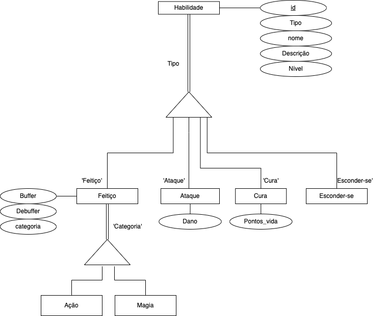
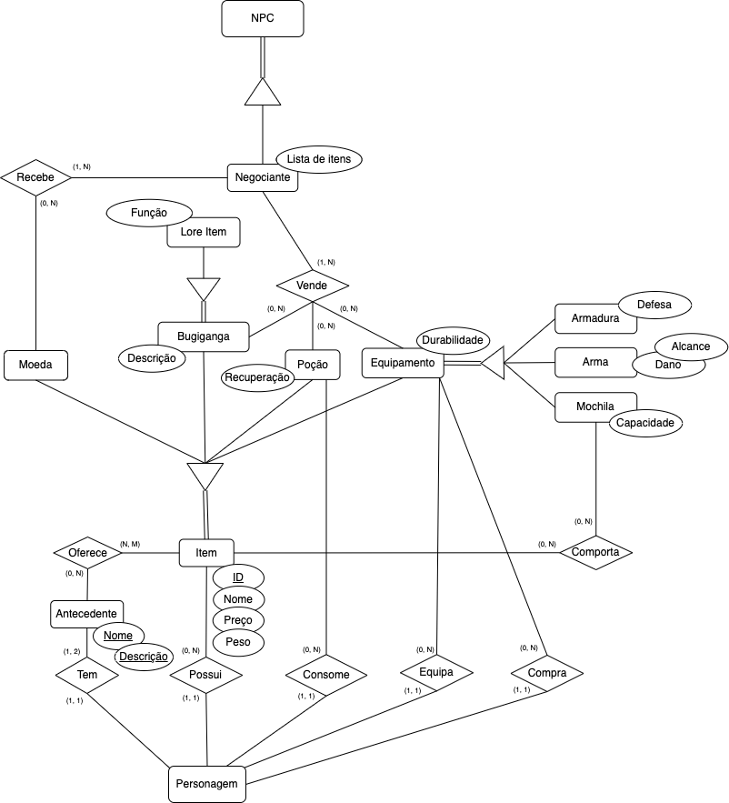
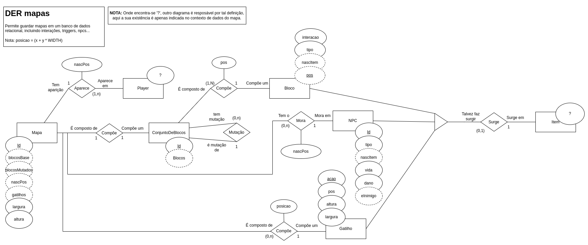
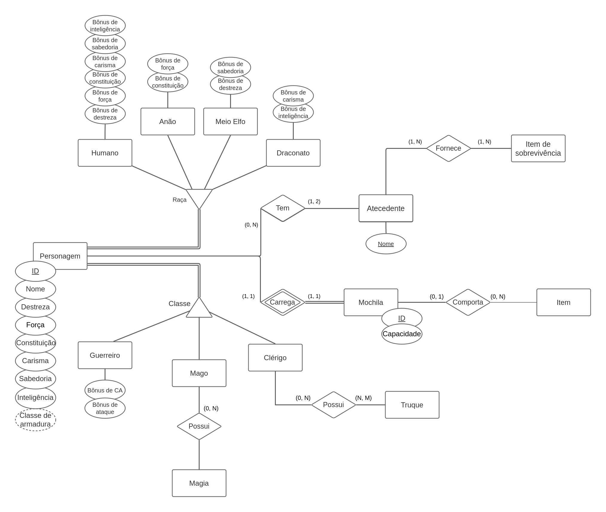
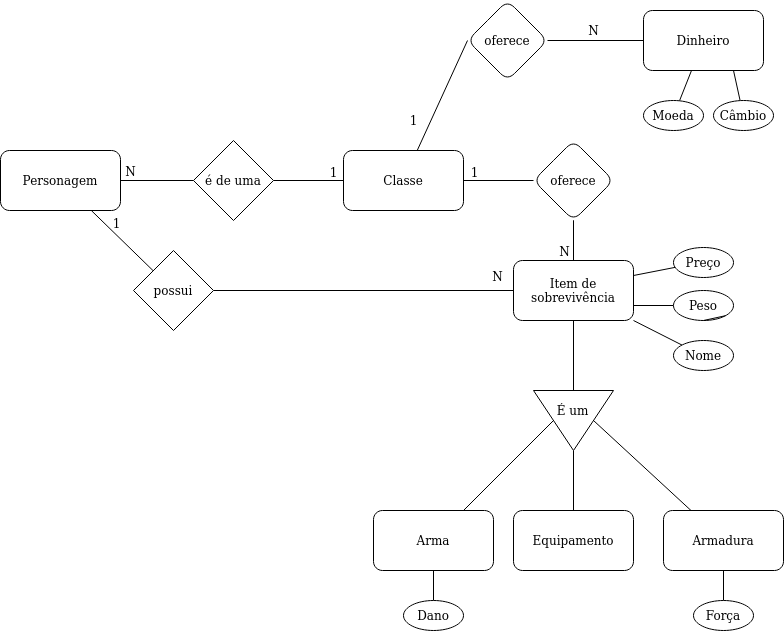

# Modelo Entidade Relacionamento

O Modelo Entidade Relacionamento (MER) é um modelo conceitual utilizado em Sistemas de Bancos de Dados para descrever as entidades envolvidas em um domínio de negócios, com seus atributos e como eles se relacionam entre si (relacionamentos). Este modelo representa de forma abstrata a estrutura que possuirá o banco de dados da aplicação.

## Diagrama Entidade Relacionamento

Um diagrama Entidade Relacionamento (DER) é um tipo de fluxograma que ilustra como entidades, objetos ou conceitos, se relacionam entre si dentro de um sistema.

Para o presente trabalho, foram desenvolvidos pequenos módulos de DER para que, assim que unidos, formassem uma representação em alto nível fidedigna do sistemas de bancos de dados idealizado para o jogo da Dungeon de Bruvic.

### DER do habilidades

> Autor: Gabriel Davi

 

### DER de itens

> Autor: Leonardo Gomes

 

### DER de mapa

> Autor: Renato Britto

 

### DER de personagens

> Autor: Hugo Sobral

 

### DER de itens de sobrevivência

> Autora: Shayanne Alcântara

 

## DER de Bruvic (Diagrama geral) 

 

### Especificações do diagrama em texto

- As entidades **Humano**, **Anão**, **Meio Elfo** e **Draconato** são especificações de raça da entidade genérica **Personagem**.
- As entidades **Guerreiro**, **Mago** e **Clérigo** são especifações de classe da entidade genérica **Personagem**.
- As entidades **Ataque**, **Cura**, **Truque** e **Magia** são especificações de tipo da entidade genérica **Habilidade**.
- As entidades **Arma**, **Armadura** e **Mochila** são especificações de propósito da entidade genérica **Equipamento**.
- A entidade **Item de história** é uma especificação de função da entidade genérica **Bugiganga**.
- As entidades **Bugiganga**, **Poção** e **Equipamento** são especificações de tipo da entidade genérica **Item**.
- A entidade **Negociante** é uma especificação de tipo da entidade genérica **NPC**.

### Especificações do modelo
#### Restrição de valores para os bônus fornecidos
As especificações de raça de personagem fornecem bônus de atributos para o personagem. Entretanto, para fins de balanceamento e customização dentro do jogo, o jogador poderá somente distribuir 6 pontos dentre os bônus disponíveis para a raça.

### Observações
Como a visualização do diagrama pode estar comprometida durante a leitura deste documento, sugere-se a visualização mais detalhada por meio da imagem hospedada no repositório do GitHub. A imagem pode ser acessada [por este link](https://github.com/SBD1/Grupo12_Bruvic/blob/d50ae66424e7385410561e0fb8d88e2321a781c4/Modulo%201%20-%20DER/der_bruvic_v2.png).