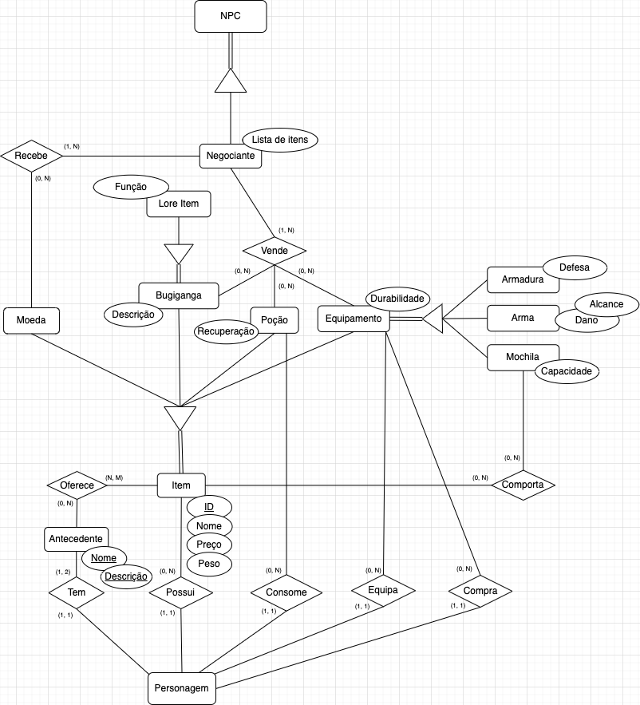

# Modelo Entidade Relacionamento

O Modelo Entidade Relacionamento (MER) é um modelo conceitual utilizado em Sistemas de Bancos de Dados para descrever as entidades envolvidas em um domínio de negócios, com seus atributos e como eles se relacionam entre si (relacionamentos). Este modelo representa de forma abstrata a estrutura que possuirá o banco de dados da aplicação.

## Diagrama Entidade Relacionamento

Um diagrama Entidade Relacionamento (DER) é um tipo de fluxograma que ilustra como entidades, objetos ou conceitos, se relacionam entre si dentro de um sistema.

Para o presente trabalho, foram desenvolvidos pequenos módulos de DER para que, assim que unidos, formassem uma representação em alto nível fidedigna do sistemas de bancos de dados idealizado para o jogo da Dungeon de Bruvic.

### DER do habilidades

> Autor: Gabriel Davi

### DER de itens

> Autor: Leonardo Gomes

### DER de mapa

> Autor: Renato Britto

### DER de personagens

> Autor: Hugo Sobral

### DER de itens de sobrevivência

> Autora: Shayanne Alcântara

## DER de Bruvic (Diagrama geral) 

### Especificidades do diagrama em texto